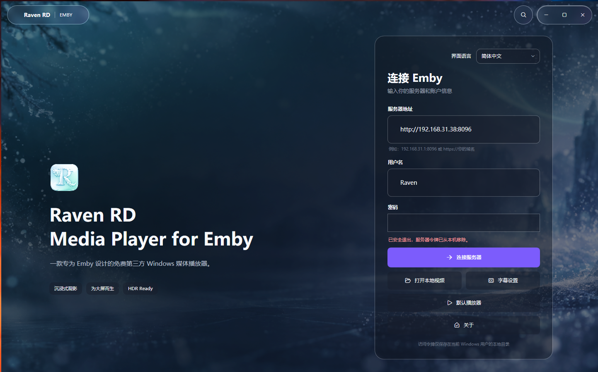
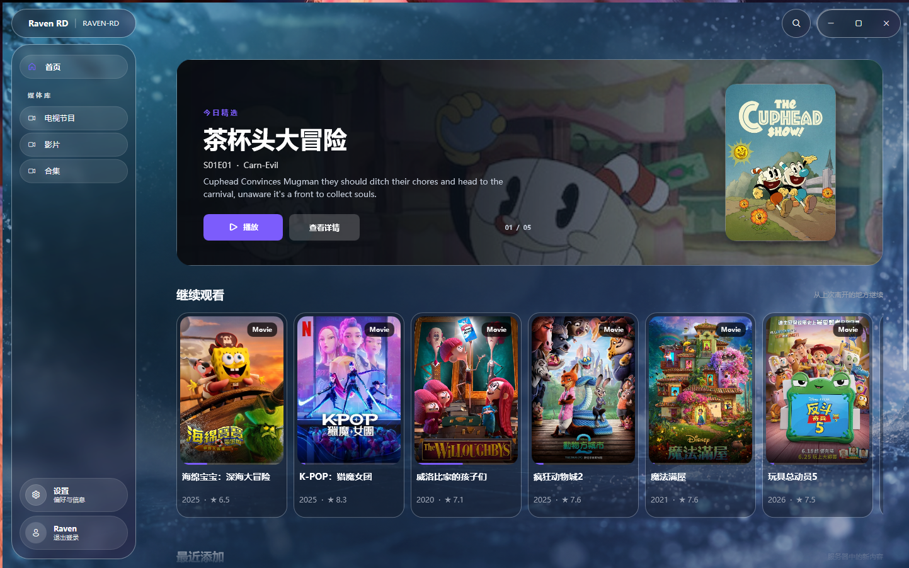
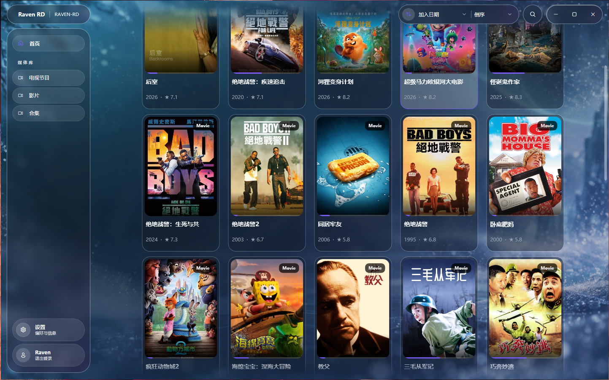
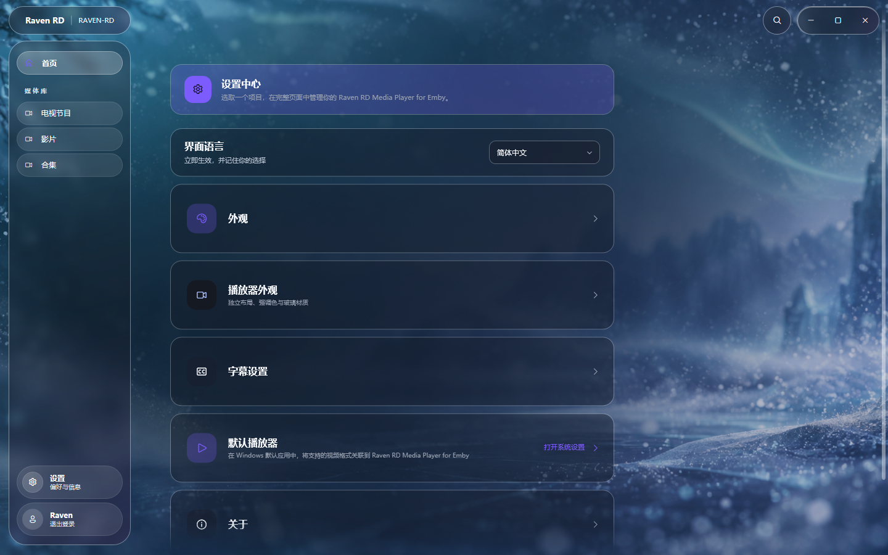
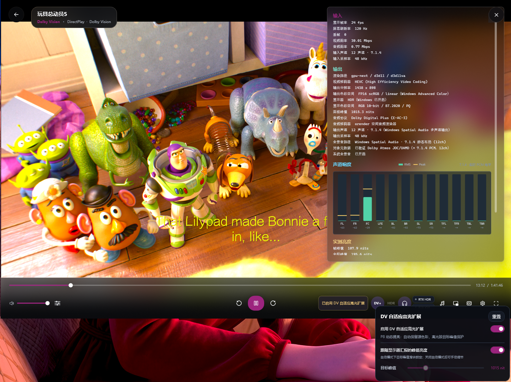
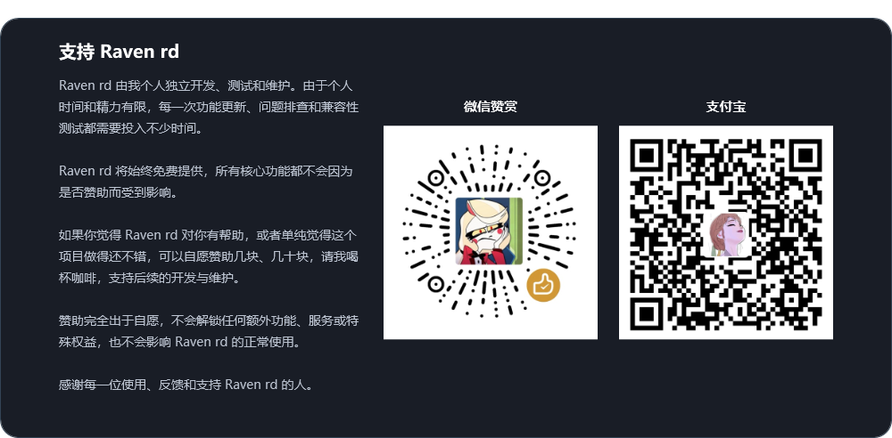

# Raven rd media player for Emby

[简体中文](README.md) | [English](README_EN.md)

Raven rd media player for Emby 是一款面向 Windows 的原生第三方 Emby 客户端与媒体播放器。它使用 WPF 构建界面，使用项目内置的 libmpv 播放内核，不依赖 WebView、Electron 或外部播放器窗口。

## 关于

Raven rd media player for Emby 最初源于一个很简单的需求：我一直没能在 Windows 平台上找到一个真正符合自己使用习惯、播放体验也足够满意的 Emby 客户端，因此最后决定自己设计和开发一个。Raven rd的播放体验始终围绕 HDR 展开，其中对 Dolby Vision Profile 8.1 与 Profile 5 片源的处理是重点优化方向之一。经过多轮调整和实际片源测试，目前 Raven 的动态亮度映射在高光控制、暗部细节和整体画面层次方面，已经能够呈现出非常接近我在苹果设备上播放 Dolby Vision 内容时的主观观感。

从界面设计、播放功能到兼容性测试，Raven 一直由我个人独立完成。项目经历了多个版本的持续迭代、重构和测试，也推翻过不少早期方案。经过不断调整后，现在的 Raven 终于基本定型，已经达到了可以稳定用于日常播放的状态。

Raven rd 最初只是一个自用项目兼顾学习用，也希望能给其他 Windows 平台上的 Emby 用户多一个选择。

由于项目由个人独立开发、测试和维护，能够投入的时间和精力都比较有限，因此 Bug 测试、硬件兼容性、媒体格式覆盖和问题修复无法做到面面俱到，版本更新也可能不会十分及时。后续更新将根据实际使用情况、用户反馈以及个人时间安排决定，目前没有固定的更新计划。

我曾经也是 Jellyfin 用户，但由于稳定版本更新周期较长，实际使用中也经常遇到一些问题，后来转而使用 Emby。未来 Raven 也可能增加 Jellyfin 接入功能，但是否实现以及何时实现，仍会根据实际需求和用户反馈决定。

Raven rd 的目标，是尽可能把 Emby 媒体库管理、远程播放、本地媒体播放以及 Windows 原生影音能力集中到一个统一的桌面应用中。

与单纯基于网页封装的客户端相比，Raven 直接使用 Windows 原生窗口、D3D11 视频输出、WASAPI 音频以及 Windows 显示设备信息，因此可以更直接地处理 HDR、音频输出、字幕、播放控制和本地媒体文件等功能。

> **Raven rd 由个人独立开发、测试和维护，并将始终免费提供。**

**Bilibili：** [Raven rd](https://space.bilibili.com/254066491)  
功能展示、使用演示和后续更新内容将逐步发布于 Bilibili。

## 使用定位与 STRM 支持声明

Raven rd是我根据个人需求开发并免费分享的软件，主要服务于我自己的 Emby 与 NAS 使用环境。项目的功能取舍和维护安排以个人实际需求及可投入的时间为准，不承诺满足所有使用场景。

**Raven rd不支持直接打开或解析 `.strm` 文件，未来也没有增加支持的计划。** 我的媒体文件存放于自建 NAS，目前没有 STRM 使用场景和相应的测试环境，因此基于 STRM 的播放方案不在本项目的兼容性测试与专项适配范围内。Emby 自身支持 STRM，并不代表 Raven 对相关播放方案作出兼容性承诺。

如果 STRM 是你的必要功能，请选择其他明确支持该功能的播放器。欢迎理性提出具体意见，我会在能力和时间允许的范围内回复和改进；无端指责、人身攻击或挑衅式交流，恕不回应。

## 主要功能

### 界面展示

<table>
  <tr>
    <td></td>
    <td></td>
    <td></td>
  </tr>
  <tr>
    <td></td>
    <td></td>
    <td></td>
  </tr>
</table>

### 客户端

- 连接 Emby 服务器并完成用户登录。
- 保存会话访问令牌，不保存用户密码。
- 浏览媒体库、最近添加、继续观看和媒体详情。
- 支持电影、剧集、季、分集、合集和人物信息展示。
- 支持媒体库搜索、排序、筛选和瀑布流卡片布局。
- 支持 Emby 播放地址、字幕地址、音轨信息和播放进度同步。

### 原生播放

- 基于项目内置 libmpv 播放内核。
- 使用原生 Win32 视频窗口与 D3D11 输出。
- 支持播放统计、媒体信息、音频声道电平和实时播放状态查看。
- 支持跳过片头入口。
- 支持画中画播放及独立的画中画控制窗口。
- 支持多音轨、外挂字幕、字幕选择和字幕延迟调整。
- 支持字幕字体、字号、颜色、透明度、阴影、描边、位置等样式设置。
- 支持将当前可下载的文本字幕导出到本地，并应用当前字幕延迟。

### 本地播放

- 可注册为 Windows 默认视频播放器，并通过系统文件关联直接打开本地视频文件，无需先登录 Emby。
- 支持多选文件并形成当前会话内的本地播放队列。
- 本地播放复用同一套原生播放画面、控制层、字幕和音频设置。

### HDR、SDR 与视频增强

- 根据当前播放窗口所在显示器读取 Windows HDR、DXGI 色彩空间、适配器和显示设备信息。
- 支持原生 HDR 输出路径，并根据显示器能力选择相应的 D3D11/libplacebo 输出。
- Windows HDR 未开启时，支持 HDR 到 SDR 映射，尽量保留高光、对比度和色彩层次。
- 支持 HDR10、HLG，并针对部分 Dolby Vision Profile 提供识别及相应的播放处理路径。
- 针对 Dolby Vision Profile 8.1 与 Profile 5 提供动态亮度映射等专门的播放优化。
- 支持 HDR 峰值、输出色彩空间和显示状态等简易播放诊断信息。
- 支持调用 NVIDIA RTX HDR，用于符合支持条件的非原生 HDR 内容增强。
- 支持调用 NVIDIA RTX Video Super Resolution（RTX VSR），用于符合支持条件的视频增强。

视频增强属于硬件和驱动相关功能。能否实际启用取决于 GPU、驱动版本、显示器、Windows HDR 状态、媒体类型和当前输出路径。

### 音频与空间音频

- 支持标准 WASAPI 音频输出。
- 支持 Windows Spatial Audio 状态识别与空间音频相关播放路径。
- 支持多声道音频、音轨选择和独立声道音量调节。
- 支持实时音频电平显示，包括解码后 PCM 声道的 RMS 与峰值信息。
- 支持 Dolby Digital Plus、TrueHD 等音频格式的常规解码与多声道播放。
- 对包含对象音频元数据的部分片源，Raven 会提取可用的对象信息，并在自身播放链路中将其映射至最多 12 声道的输出路径，以尽可能保留原始声场中的空间信息。
- 该处理方式属于 Raven 自身实现的多声道空间音频方案，并非 Dolby 官方 Atmos 解码、直通或认证实现。
- 实际输出效果取决于片源、解码路径、Windows Spatial Audio、默认播放设备、驱动及最终音频设备。

### 界面与个性化

- 统一的深色原生桌面界面。
- 首页、媒体库、详情页、播放控制和设置页使用一致的材质与视觉语言。
- 支持默认背景、自定义背景、背景透明度、强调色和多种界面材质。
- 支持沉浸式背景、瀑布流布局、胶囊式导航和搜索入口。
- 支持中文与英文界面切换。

## 系统要求

### 基本要求

- Windows 10 版本 2004（Build 19041）或更高版本。
- 64 位 Windows 系统。
- x64 处理器。
- 支持 Direct3D 11 的显卡驱动。
- Emby 功能需要可访问的 Emby 服务器和有效的用户权限。

安装包为 Windows x64 版本。运行时所需的 .NET 组件会随发布包提供，系统仍需要能够正常使用 WPF、D3D11、Windows Core Audio 和相关 Windows 图形接口。

### HDR 与视频增强要求

- 原生 HDR 需要 HDR 显示器、Windows HDR 和支持 HDR 输出的 GPU/驱动。
- HDR 到 SDR 可以在 SDR 显示器上使用，但最终观感受片源、显示器亮度、色域和用户设置影响。
- RTX HDR 与 RTX VSR 需要支持的 NVIDIA GPU、驱动和对应媒体条件。
- 4K、高码率、HDR、Dolby Vision 和多声道媒体可能增加 GPU、CPU、显存、磁盘和网络带宽压力。

### 空间音频要求

- 空间音频功能依赖 Windows 音频设置、当前默认播放设备、驱动和输出设备。
- Dolby Digital Plus、TrueHD 及其他多声道音频的实际播放能力取决于片源、解码路径和系统音频环境。
- 对包含对象音频信息的部分片源，Raven 会根据可获取的对象元数据进行多声道映射，最高使用 12 声道输出路径。
- Raven 的对象音频处理并非 Dolby 官方 Atmos 解码或认证实现，最终空间感和声场表现会受到 Windows Spatial Audio、播放设备及系统配置影响。

## 使用说明

### 连接 Emby

1. 启动 Raven rd。
2. 输入 Emby 服务器根地址，例如 `https://example.com` 或 `https://example.com/emby`。
3. 输入 Emby 用户名和密码并登录。
4. 登录成功后，从首页或左侧媒体库入口选择内容。
5. 点击影片、剧集或分集卡片进入详情页并开始播放。

### 播放本地视频

1. 在登录页选择“打开本地视频”。
2. 选择一个或多个本地视频文件。
3. Raven 会将所选文件建立为当前播放队列。
4. 可使用上一项、下一项、播放列表、字幕、音轨和播放控制功能。

本地播放不需要连接 Emby，也不会同步到 Emby 继续观看列表。

### 调整字幕

可以在设置中的字幕选项调整字体、字号、颜色、透明度、阴影、描边、位置和延迟。字幕设置同时适用于本地视频和 Emby 媒体。

## 问题反馈

如遇到问题，可通过 GitHub Issues 提交反馈。提交问题前，请尽量提供以下信息：

- Raven 版本号。
- Windows 版本和系统更新版本。
- GPU 型号及驱动版本。
- 显示器是否开启 Windows HDR。
- Emby 服务器版本、连接方式和媒体类型。
- 问题发生在 Emby 播放还是本地播放。
- 是否涉及 HDR、Dolby Vision、RTX HDR、RTX VSR、空间音频或字幕。
- 可复现步骤、错误提示和必要的截图。

> **请勿在公开 Issue 中提交 Emby 密码、访问令牌、私人服务器地址或其他个人隐私数据。**

## 支持 Raven rd

  

## 第三方组件

Raven rd 使用或集成了以下第三方组件、系统技术、开发工具和外部接口：

- .NET 8 与 WPF。
- libmpv 及其 FFmpeg 解码、滤镜和播放能力。
- libplacebo，用于视频色彩管理、HDR 和 tone mapping 相关处理。
- D3D11、DXGI、Windows Core Audio、WASAPI 和 Windows Spatial Audio。
- Microsoft Windows App SDK、Win2D 和 InteropCompositor 相关组件。
- Fluent System Icons 字体资源。
- WiX Toolset 4，用于构建 Windows 安装包。
- Emby REST API，用于服务器登录、媒体库、媒体详情、播放地址、字幕和播放进度交互。

Raven rd 所使用的第三方组件仍归其各自作者或权利人所有，并按照各自适用的许可证条款使用。

随 Raven 分发的第三方组件将按照其各自许可证要求保留必要的版权及许可信息。

Raven rd 不包含 Emby Server，也不提供或修改 Emby 服务器程序。

## 免责声明

- Raven rd是个人独立开发的第三方 Windows 客户端，不隶属于 Emby 官方，也未获得 Emby 官方背书或认证。
- Raven rd仅用于访问用户自行拥有访问权限的 Emby 服务器及媒体内容。
- 播放能力和最终效果可能受到片源封装、编码格式、服务器配置、网络环境、GPU、驱动程序、显示设备、音频设备及 Windows 系统设置等因素影响。
- HDR、Dolby Vision、RTX HDR、RTX VSR、空间音频等相关功能能否正常使用，取决于对应硬件、系统、驱动及相关技术本身的支持情况。
- 用户应自行确保其服务器、媒体文件、字幕及播放设备的使用符合当地法律法规以及相关内容和服务的授权要求。
- 软件按现状免费提供。对于因使用 Raven 产生的播放中断、数据丢失、设备兼容性问题或其他间接损失，开发者在适用法律允许的范围内不承担责任。

## 版权

- Copyright © 2026 Raven rd. All rights reserved.
- 除明确标注为第三方内容的部分外，Raven 的原创程序代码、界面设计、文档、配置、脚本及其他原创内容的相关权利归 Raven rd 所有。
- Raven 可供用户免费下载、安装和个人使用。未经授权，不得对 Raven 进行重新打包、重新发布、冒充官方版本进行分发，或未经许可使用 Raven 的名称、标识、界面资源及其他原创内容制作具有误导性的衍生版本。
- Raven 所使用的第三方组件、字体、图标、商标及其他第三方内容，其权利仍归各自作者或权利人所有，并按照各自适用的许可证或使用条款使用。
