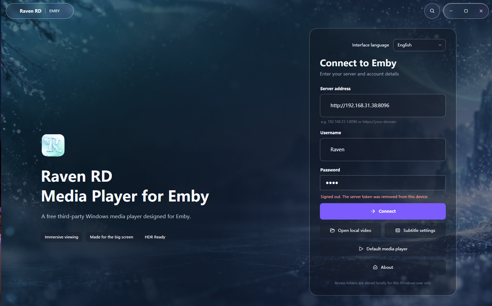
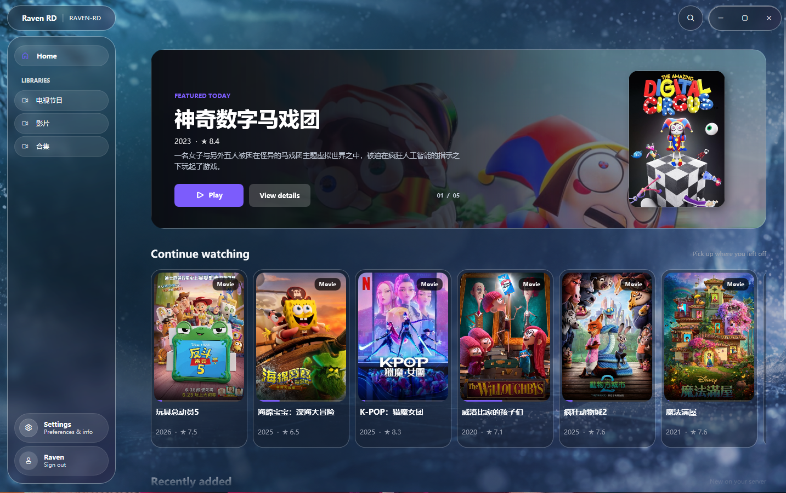
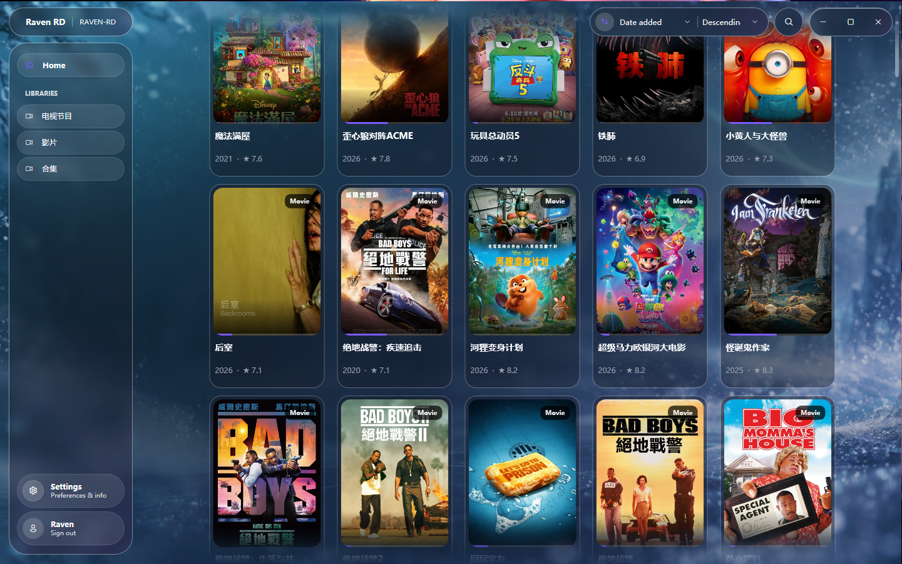
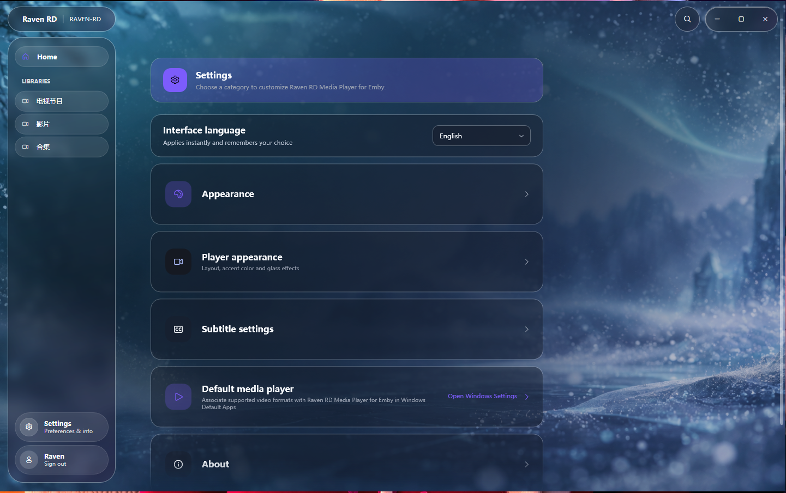
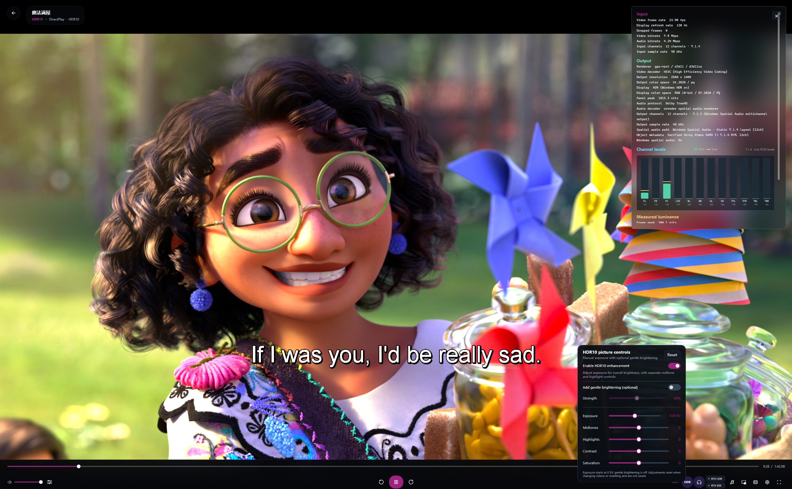
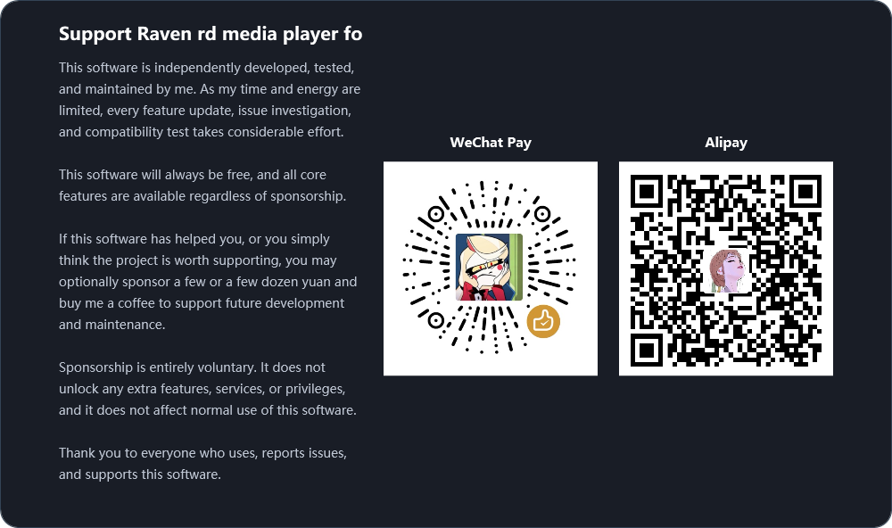

# Raven rd media player for Emby

[简体中文](README.md) | **English**

Raven rd media player for Emby is a native third-party Emby client and media player for Windows. Its interface is built with WPF and it uses an integrated libmpv playback engine, without relying on WebView, Electron, or an external player window.

## About Raven

Raven rd media player for Emby started from a very simple need: I could never find an Emby client on Windows that truly matched the way I wanted to use it while also delivering a playback experience I was satisfied with, so I eventually decided to design and build one myself.

Raven's playback experience has always been centered around HDR, with Dolby Vision Profile 8.1 and Profile 5 being two of the main areas of optimization. After multiple rounds of tuning and real-world media testing, Raven's dynamic brightness mapping can now deliver highlight control, shadow detail, and overall image depth that, in my subjective experience, comes very close to the way Dolby Vision content looks when played on Apple devices.

From interface design and playback features to compatibility testing, Raven has been independently developed by me. The project has gone through many versions, rewrites, redesigns, and rounds of testing, with quite a few early approaches discarded along the way. After continuous refinement, Raven has now reached a relatively mature state and is stable enough for everyday use.

Raven originally started as a personal project, but I now hope it can also give other Windows Emby users another option.

Because Raven is independently developed, tested, and maintained by one person, the amount of time and energy I can dedicate to it is limited. Bug testing, hardware compatibility, media format coverage, and issue resolution therefore cannot be exhaustive, and updates may not always arrive quickly. Future development will depend on actual usage, user feedback, and my available time. There is currently no fixed update schedule.

I was also a Jellyfin user in the past, but because stable releases often had long update cycles and I frequently encountered various issues in daily use, I eventually moved to Emby. Raven may support Jellyfin in the future, but whether and when that happens will depend on actual demand and user feedback.

Raven's goal is to bring Emby media library management, remote playback, local media playback, and native Windows audio/video capabilities together in a single desktop application.

Unlike clients that are primarily web wrappers, Raven directly uses native Windows windows, D3D11 video output, WASAPI audio, and Windows display device information. This allows it to handle HDR, audio output, subtitles, playback controls, and local media files more directly.

> **Raven is independently developed, tested, and maintained by one person, and will always be provided free of charge.**

**Bilibili:** [Raven rd](https://space.bilibili.com/254066491)  
Feature showcases, usage demonstrations, and future update information will gradually be published on Bilibili.

## Main Features

## Intended Use and STRM Support

Raven is software I developed for my own needs and share free of charge. It primarily serves my personal Emby and NAS setup. Feature decisions and maintenance priorities depend on my actual needs and available time. The project does not promise to accommodate every use case.

**Raven does not support opening or parsing `.strm` files, and there are no plans to add STRM support.** My media files are stored on my own NAS, and I currently have neither a STRM use case nor a suitable testing environment. STRM-based playback setups are therefore outside the scope of this project's compatibility testing and dedicated support. Emby's own support for STRM does not imply that Raven guarantees compatibility with those setups.

If STRM is essential to your needs, please choose another player that explicitly supports it. Constructive, specific feedback is welcome, and I will respond and make improvements as my time and capabilities allow. Baseless accusations, personal attacks, and deliberately provocative comments will not receive a response.

### Interface Preview

<table>
  <tr>
    <td></td>
    <td></td>
    <td></td>
  </tr>
  <tr>
    <td></td>
    <td></td>
    <td></td>
  </tr>
</table>

### Emby Client

- Connect to an Emby server and sign in with a user account.
- Store session access tokens without storing user passwords.
- Browse media libraries, recently added items, continue watching, and media details.
- Display movies, TV shows, seasons, episodes, collections, and person information.
- Support library search, sorting, filtering, and waterfall-style card layouts.
- Support Emby playback URLs, subtitle URLs, audio track information, and playback progress synchronization.

### Native Playback

- Powered by the integrated libmpv playback engine.
- Uses a native Win32 video window with D3D11 output.
- Supports playback statistics, media information, audio channel levels, and real-time playback status.
- Supports skip-intro entry points.
- Supports Picture-in-Picture playback with a dedicated PiP control window.
- Supports multiple audio tracks, external subtitles, subtitle selection, and subtitle delay adjustment.
- Supports subtitle font, size, color, opacity, shadow, outline, position, and other styling options.
- Supports exporting currently downloadable text subtitles to local storage while applying the current subtitle delay.

### Local Playback

- Can be registered as the default Windows video player and open local video files directly through Windows file associations without requiring an Emby login.
- Supports selecting multiple files and creating a local playback queue for the current session.
- Local playback uses the same native video output, control layer, subtitle system, and audio settings as Emby playback.

### HDR, SDR, and Video Enhancement

- Reads Windows HDR status, DXGI color space, graphics adapter, and display device information for the monitor currently hosting the playback window.
- Supports native HDR output paths and selects appropriate D3D11/libplacebo output based on display capabilities.
- When Windows HDR is disabled, HDR-to-SDR mapping is available to preserve as much highlight detail, contrast, and color depth as possible.
- Supports HDR10 and HLG, with recognition and corresponding playback processing paths for selected Dolby Vision profiles.
- Provides dedicated playback optimizations for Dolby Vision Profile 8.1 and Profile 5, including dynamic brightness mapping.
- Provides basic playback diagnostics including HDR peak brightness, output color space, and display status.
- Supports invoking NVIDIA RTX HDR for eligible non-native HDR content.
- Supports invoking NVIDIA RTX Video Super Resolution (RTX VSR) for eligible video enhancement.

Video enhancement features depend on hardware and drivers. Actual availability depends on the GPU, driver version, display, Windows HDR status, media type, and current output path.

### Audio and Spatial Audio

- Supports standard WASAPI audio output.
- Supports Windows Spatial Audio status detection and related playback paths.
- Supports multichannel audio, audio track selection, and independent channel volume adjustment.
- Supports real-time audio level monitoring, including RMS and peak values for decoded PCM channels.
- Supports conventional decoding and multichannel playback of formats such as Dolby Digital Plus and TrueHD.
- For selected media containing object-based audio metadata, Raven extracts available object information and maps it within its own playback pipeline to an output path of up to 12 channels, with the goal of preserving as much spatial information from the original sound field as possible.
- This is Raven's own multichannel spatial audio implementation and is not an official Dolby Atmos decoder, passthrough implementation, or certified Dolby solution.
- Actual output depends on the source media, decoding path, Windows Spatial Audio, default playback device, drivers, and final audio hardware.

### Interface and Personalization

- Unified native dark desktop interface.
- Consistent materials and visual language across the home page, media library, detail pages, playback controls, and settings.
- Supports default backgrounds, custom backgrounds, background opacity, accent colors, and multiple interface materials.
- Supports immersive backgrounds, waterfall-style layouts, pill-shaped navigation, and search entry points.
- Supports switching between Chinese and English interfaces.

## System Requirements

### Basic Requirements

- Windows 10 version 2004 (Build 19041) or later.
- 64-bit Windows.
- x64 processor.
- A graphics driver with Direct3D 11 support.
- Emby functionality requires access to an Emby server and valid user permissions.

The installer is provided for Windows x64. Required .NET runtime components are included with the release package, while the operating system must still support WPF, D3D11, Windows Core Audio, and the related Windows graphics interfaces.

### HDR and Video Enhancement Requirements

- Native HDR requires an HDR-capable display, Windows HDR enabled, and a GPU/driver capable of HDR output.
- HDR-to-SDR can be used on SDR displays, but the final result depends on the source media, display brightness, color gamut, and user settings.
- RTX HDR and RTX VSR require a supported NVIDIA GPU, compatible drivers, and eligible media conditions.
- 4K, high-bitrate, HDR, Dolby Vision, and multichannel media may place additional demands on GPU, CPU, VRAM, storage, and network bandwidth.

### Spatial Audio Requirements

- Spatial audio functionality depends on Windows audio settings, the current default playback device, drivers, and output hardware.
- Actual playback support for Dolby Digital Plus, TrueHD, and other multichannel audio formats depends on the source media, decoding path, and system audio environment.
- For selected media containing object-based audio information, Raven performs multichannel mapping based on available object metadata, using an output path of up to 12 channels.
- Raven's object-based audio processing is not an official Dolby Atmos decoder or certified implementation. The resulting spatial presentation depends on Windows Spatial Audio, playback hardware, and system configuration.

## Usage

### Connecting to Emby

1. Launch Raven.
2. Enter the root address of your Emby server, for example `https://example.com` or `https://example.com/emby`.
3. Enter your Emby username and password, then sign in.
4. After signing in successfully, select content from the home page or the media library navigation on the left.
5. Open a movie, TV show, or episode detail page and start playback.

### Playing Local Videos

1. Select "Open Local Video" on the login page.
2. Select one or more local video files.
3. Raven will create a playback queue from the selected files for the current session.
4. You can use previous/next item controls, playlists, subtitles, audio tracks, and other playback controls normally.

Local playback does not require an Emby connection and does not synchronize progress to the Emby Continue Watching list.

### Adjusting Subtitles

Subtitle settings allow you to adjust font, size, color, opacity, shadow, outline, position, and delay. These settings apply to both local video playback and Emby media.

## Bug Reports and Feedback

If you encounter an issue, you can submit it through GitHub Issues. When reporting a problem, please provide as much of the following information as possible:

- Raven version.
- Windows version and system update version.
- GPU model and driver version.
- Whether Windows HDR is enabled on the display.
- Emby server version, connection method, and media type.
- Whether the problem occurs during Emby playback or local playback.
- Whether the issue involves HDR, Dolby Vision, RTX HDR, RTX VSR, spatial audio, or subtitles.
- Reproduction steps, error messages, and relevant screenshots.

> **Do not post your Emby password, access token, private server address, or other personal information in a public GitHub Issue.**

## Support Raven

  

## Third-Party Components

Raven rd uses or integrates the following third-party components, system technologies, development tools, and external interfaces:

- .NET 8 and WPF.
- libmpv and its FFmpeg decoding, filtering, and playback capabilities.
- libplacebo for video color management, HDR, and tone mapping related processing.
- D3D11, DXGI, Windows Core Audio, WASAPI, and Windows Spatial Audio.
- Microsoft Windows App SDK, Win2D, and InteropCompositor related components.
- Fluent System Icons font resources.
- WiX Toolset 4 for building the Windows installer.
- Emby REST API for server login, media libraries, media details, playback URLs, subtitles, and playback progress interaction.

Third-party components used by Raven rd remain the property of their respective authors or rights holders and are used in accordance with their applicable license terms.

Third-party components distributed with Raven will retain the copyright notices and license information required by their respective licenses.

Raven rd does not include Emby Server and does not provide or modify the Emby server software.

## Disclaimer

- Raven is an independently developed third-party Windows client created by Raven rd. It is not affiliated with Emby and has not been officially endorsed or certified by Emby.
- Raven is intended only for accessing Emby servers and media content that the user is authorized to access.
- Playback capabilities and final output may be affected by media container formats, codecs, server configuration, network conditions, GPU hardware, drivers, display devices, audio devices, and Windows system settings.
- The availability and behavior of HDR, Dolby Vision, RTX HDR, RTX VSR, spatial audio, and related features depend on the corresponding hardware, operating system, drivers, and underlying technologies.
- Users are responsible for ensuring that their use of servers, media files, subtitles, and playback devices complies with applicable local laws, regulations, licenses, and content usage rights.
- The software is provided free of charge and as-is. To the extent permitted by applicable law, the developer is not responsible for playback interruptions, data loss, compatibility issues, or other indirect losses arising from the use of Raven.

## Copyright

- Copyright © 2026 Raven rd. All rights reserved.
- Except for content explicitly identified as third-party material, the copyright and related rights in Raven's original program code, interface design, documentation, configuration, scripts, and other original content belong to Raven rd.
- Raven may be downloaded, installed, and used for personal use free of charge. Without authorization, Raven may not be repackaged, redistributed, distributed while impersonating an official release, or used in ways that incorporate Raven's name, branding, interface resources, or other original content to create misleading derivative versions.
- Third-party components, fonts, icons, trademarks, and other third-party materials used by Raven remain the property of their respective authors or rights holders and are used in accordance with their applicable licenses or terms of use.
